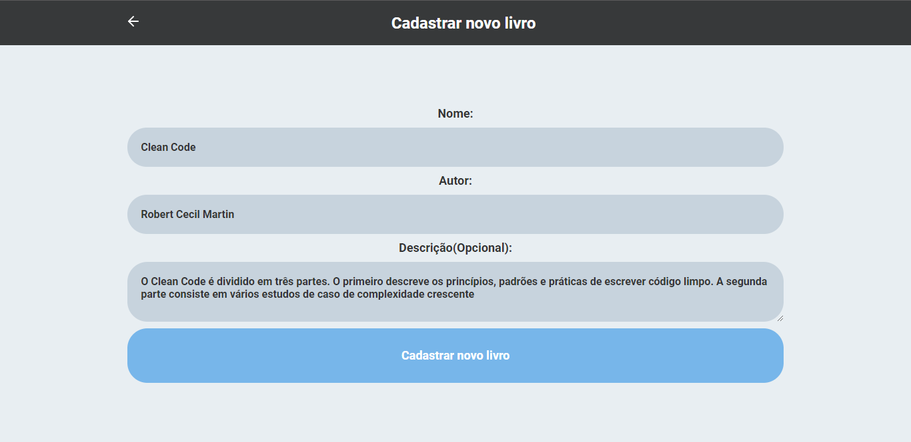
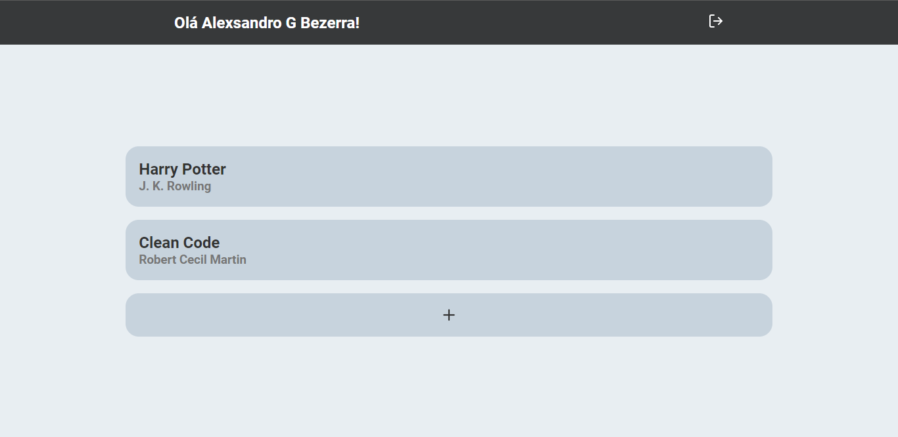
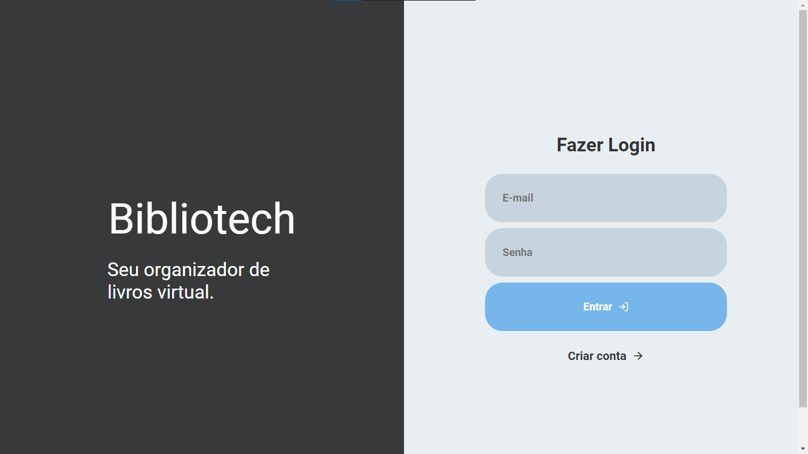
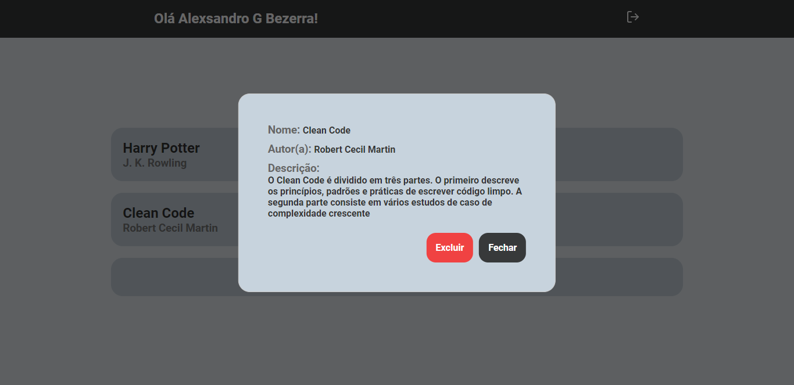
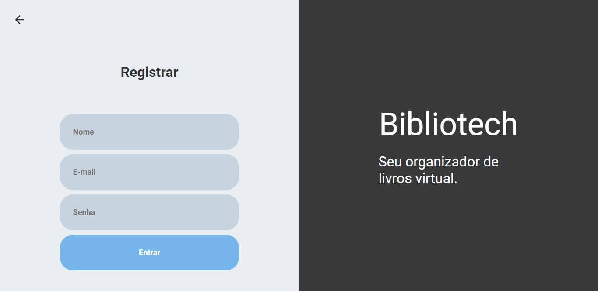

# BiblioTech

<div style="display: flex; flex-direction: 'row'; align-items: 'center'; flex-wrap: wrap;">
   
   
   
   
   
</div>

# Índice
<p align="center">
  <a href="#sobre">Sobre</a>&nbsp;&nbsp;&nbsp;|&nbsp;&nbsp;&nbsp;
  <a href="#requisitos">Pré-Requisitos</a>&nbsp;&nbsp;&nbsp;|&nbsp;&nbsp;&nbsp;
  <a href="#como-rodar">Como Rodar</a>&nbsp;&nbsp;&nbsp;|&nbsp;&nbsp;&nbsp;
  <a href="#licenca">Licença</a>
</p>

<p id="sobre"></p>

## :book: **Sobre**

**Bibliotech** é um app simples em que você pode salvar os livros que você mais gosta.

---

<p id="requisitos"></p>

## :heavy_exclamation_mark: **Pré-requisitos**

  - É **necessário** possuir o **[Node.js](https://nodejs.org/en/)** instalado na máquina
  - Também, é **preciso** ter um gerenciador de pacotes seja o **[Yarn](https://yarnpkg.com/)**.
  - Por fim, é **essencial** ter uma instancia do **[PostgreSQL](https://www.postgresql.org/)** rodando na sua maquina.

#### Caso tenha o **[Docker Desktop](https://www.docker.com/)** instalado basta usar esse comando pra iniciar um container com uma instancia do PostgreSQL:

```sh
docker run --name nlw -e POSTGRES_PASSWORD=docker -p 5432:5432 -d postgres
```

<p id="como-rodar"></p>

---

## :construction_worker: **Como rodar**

### :link: Clonando repositório

```sh
# Clone o Repositoria
$ git clone https://github.com/AlexSRH/BiblioTech.git
```

### :gear: Configurando ambiente
1. Crie um database com o nome `bibliotech` na sua instancia do PostgreSQL.
2. Entre na pasta `backend`, copie o conteúdo das variáveis de ambiente no arquivo `.env.example`, crie um novo arquivo chamado `.env` e cole o conteúdo.

```dosini
# Database configs
DB_PORT = 5432
DB_HOST =
DB_USER =
DB_PASSWORD =

# Secret token
APP_SECRET =

```

3. Crie um arquivo chamado `.env` e coloque as variáveis do seu ambiente
    - DB_PORT - Porta do banco de dados
    - DB_HOST - Host do banco de dados
    - DB_USER - Usuário do banco de dados
    - DB_PASSWORD - Senha do banco de dados
    - APP_SECRET - Token para criptografia do JWT(Pode colocar qualquer coisa sem espaço)


### :package: Rode a API (Backend)

```sh
# Vá para a pasta do servidor
$ cd BiblioTech/backend

# Instale as depedencias
$ yarn

# Rode as migrations
$ yarn typeorm migration:run

# Rode o ambiente de desenvolvimento da API
$ yarn dev
```

> A api vai rodar na porta 3333 por padrão. Caso queira mudar a porta [Clique aqui](.github/change-port-api.md)

Você pode ver as rotas disponíveis e testa-las no Insomnia:

[](https://insomnia.rest/run/?label=Bibliotech&uri=https%3A%2F%2Fraw.githubusercontent.com%2FAlexSRH%2FBiblioTech%2Fmaster%2FAPI%2520-Insomnia_2020-09-27.json)

### :computer: Rode o Projeto Web (Frontend)

```bash
# Vá para a pasta web
$ cd BiblioTech/web

# Instale as depedencias
$ yarn

# Rode a aplicação
$ yarn start
```
Acesse: http://localhost:3000/ para ver o resultado.

<p id="licenca"></p>

---

## :closed_book: **License**

Esse projeto está sob a licença MIT. Veja o arquivo [LICENSE](LICENSE) para mais detalhes.

---

Feito com amor por Alexsandro G Bezerra 🚀
